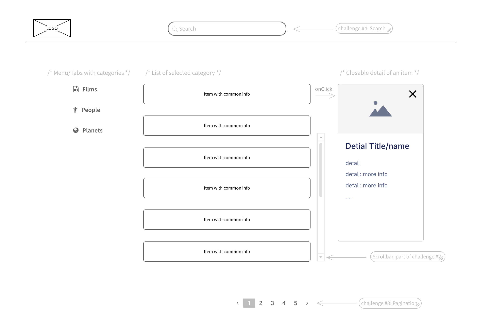

# React Interview Assignment

## Introduction

This is an interview exercise. In the following sections, you will find a number of challenges that we ask you to implement. You **DO NOT NECESSARILY need to complete 100% of them**. Some of them are more important, while others are not (depending on your skill level).

The solution should not take a lot of hours or days. The time to submit your work depends on how you agreed on it with our HR.

### Deliverables

Simply fork this repository and work on it as if you were working on a real-world project assigned to you. At the end, please create a pull request to our 'main' branch.

If you are not able to do that, please create a ZIP archive and send it to us.

### Evaluation

Your work will be assessed according to several criteria. As an example, these include:

- Code quality
- UI
- Architecture of your solution/code
- Your technical skills and ideas

**Note**: Don't worry about it! Just show us what you know and what you are able to do.

#### A Friendly Reminder:

We’re all about embracing the latest in AI, including GPT and similar technologies. They’re great tools that can provide
a helping hand, whether it’s for generating ideas, debugging, or refining solutions. However, for this coding challenge,
we’re really keen to see your personal touch. We're interested in your thought process, decision-making, and the
solutions you come up with.

Remember, while using AI tools can be incredibly helpful, the essence of this task is to showcase your skills and
creativity. Plus, be prepared to dive into the details of your code during the technical interview. Understanding the '
why' and 'how' behind your decisions is crucial, as it reflects your ability to critically engage with the technology
you're using.

So, feel free to lean on AI for support, but ensure your work remains distinctly yours. We're looking for a blend of
technical savvy and individual flair. Dive in, get creative, and let’s see what you can create. Excited to see your
work. Happy coding!

### Let's get started

We do understand that some topics might be unfamiliar to you. Please complete as much as you can, and if you’d like, feel free to showcase additional skills relevant to the solution.

For example, you can demonstrate:

- appropriate use of an external library
- your custom utils method
- CSS skills, etc., ...

**Important**: You might feel like the tasks are somehow too broad, or the requirements are not fully elicited. This is done on purpose: we want to give you the freedom to make your own choices and to put as few constraints as possible on your work.

### Basic application info

We have prepared a base structure for the application, including a header, a content area, and a footer. Your task is to enhance this web application with content about the Star Wars universe.

In this application, we use SCSS modules for every component and one global CSS file. Feel free to use it and add your own SCSS modules, or implement other CSS libraries like Tailwind if you want.

From a functional perspective, you should use public [SWAPI](https://swapi.dev/) API, which provides several endpoints to retrieve information about Star Wars films, characters, starships, vehicles, planets, and species.

For example:

- To get a list of films, you can use: https://swapi.dev/api/films API request
- To get details about a specific film (e.g., the first one), use: https://swapi.dev/api/films/1/ API request

The same pattern applies to other categories mentioned above.

For further details, please refer to the [SWAPI Documentation](https://swapi.dev/documentation).

#### Challenge #1: Create a basic Layout with UI components

Your first challenge is to build the core layout for the application’s content. The main section should consist of three separate parts:

1. **Navigation Menu/Tabs** for selecting a category (Films, People, Starships, etc.).
2. **List View** displaying items from the selected category.
3. **Detail View** showing details of the selected item from the list.

We provide a UI sketch as a reference.

**Note**: The sketch is **not a strict UI design**—you have creative freedom in designing the interface.

**Don't forget about resposivity!** Your final solution should be easily visible on a mobile devices (at least 360px wide) without any issues. The core layout is not responsive, please update it. You can decide how the responsive design should look, but it must be readable without unexpected overflows.

#### Challenge #2: Connect application to SWAPI

As we mentioned before, this challenge is about connecting SWAPI with our application.
There are plenty of ways how achieve it. You can use native functions or third-party libraries - the choice is yours. What matters to us is that it is implemented well.

In this challenge, you should be able to call the API to fetch a list from the selected category, which you can choose from the Menu/Tabs. Additionally, please implement a scrollbar for the list, as we don’t want an excessively long page displaying all items.

Besides that, you should implement another API call to fetch details of an item when it is selected from the list. When you click on the item, show a detail of it, with the data from the API request. The way, how you show it, it's on you (you have a sketch for reference). The **detail should be closable**.

#### Challenge #3: Implement pagination

This challenge builds upon the previous two challenges. For this reason, it is optional, but if you want to demonstrate your API implementation skills, this is a great opportunity!

The API response contains information about the next page and how to request it. Your task is to implement pagination for navigating through the results. Below the list, you should provide a pagination component that allows users to move forward to the next page and backward to the previous page (if it's possible). The UI design is up to you.

#### Challenge #4: Implement search

This challenge also depends on completing the first and second challenges. It is similar to the previous one, but here we will focus on form handling, field validation, and submitting data.

The search input will have two validation rules:

1. It is a required field.
2. The input value must not contain numbers.

The form with an input is implemented, it just doesn't have validations and it's not connected to API. Users can type numbers in the field, but the input should be invalidated upon submission. As with previous challenges, the way you handle validation feedback is up to you.

SWAPI provides searching functionality for any category. Here is an example of a request: https://swapi.dev/api/people/?search=skywalker

After submitting the form by pressing Enter or clicking the submit button, you should call this API with the data from the search field and the currently selected category (‘People’ in this example). The result may contain anywhere from 0 to N results. The list of results should replace the previously displayed list of category items.

#### Challenge #5: Add your components to Storybook

If you are familiar with Storybook or want to learn something new while demonstrating your skills, this is your chance!

In this challenge, you can add your custom components to Storybook and implement stories to showcase their functionality. You can highlight their capabilities or available customization option/props. You don’t need to include all your custom components—just provide some good examples.

#### Challenge #6: Place for your ideas

In this challenge, you have space for your own ideas. If you see something that can be improved or added, feel free to implement it. Experiment, be creative, and make the solution even better!

---

Good luck!
